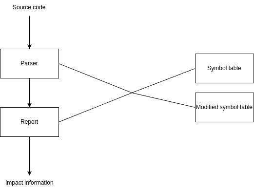

# impactdoc

Many large applications are tightly coupled, so changes in one part can affect others. This project implements a tool that extracts information from @impact tags in doc comments to help manage code changes in tightly coupled applications.

The following is a simplified diagram.



## Tags

### @impact

The @impact tag can be used to document side effects that may occur if the code is changed.

```
@impact <description>
```

Examples:

```php
/**
 * @impact This change affects login and logout functionality.
 */
function doSomething()
{
    // ...
}
```

```php
/**
 * @impact This change modifies the functionality of the document printing feature.
 */
class PrintDocumentController
{
    // ...

    /**
     * @impact This change affects the print functionality for features A, B, and C. 
       @impact Ensure that issues related to Mantis #1000, #2000 and #3000 are not reopened. 
     */
    public function printAction()
    {
        // ...
    }
}
```

## Requirements

* g++ with support for the C++20 standard
* make

## Build

```sh
$ make
```

## Usage

```sh
$ impactdoc <filename.php> <ModifiedLinesSeparatedBySpaces>
```

## Current issues

The current version is a pre-release and only supports parsing PHP code. If you want to fix a bug or implement a new feature, feel free to submit a pull request.
